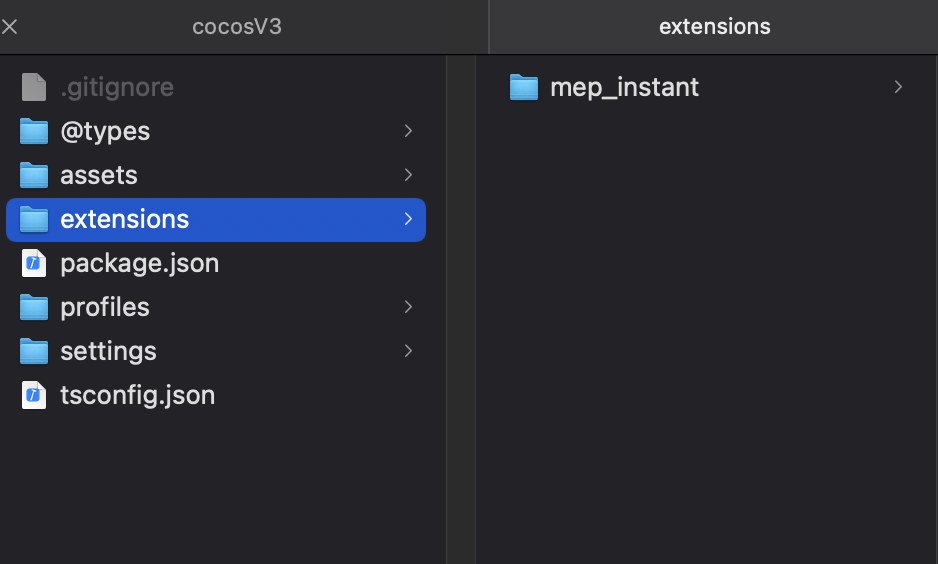
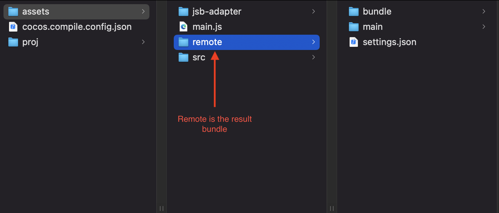

## Prerequisite
- Cocos Creator version 3.2.0
- Programming language: Typescript.
- mep_instant’s cocos extension: 
  - [Cocos's guideline](https://docs.cocos.com/creator/3.2/manual/en/editor/extension/install.html)
  - [mep_instant cocos creator](#mepintant-sdk)
- Game bundling: [cocos’s guideline](https://docs.cocos.com/creator/3.2/manual/en/asset/bundle.html)
- SandboxApp testflight version 2.0.0 - 202110121612
- Bundle size limit: 5MB

## Unsupported
- cookie
- DOM
- NodeJS 

## Sample steps to test with SandBox app
> [Sample template](../resources/mep-instant-samplegame-native_v3.zip)  
> Sample Game: Magic Tiles 3  
> Sample Game ID: mt3

- install [mep_instant’s cocos extension](#prerequisite) in project  

- [Bundling project](#prerequisite)  

- Export bundle  

- <b>Testing: </b>
  1. rename result folder to to "url"  
  2. Zip "url" folder
  3. Host "url.zip" file on CDN and start testing with iOS Sandbox on testflight
- [Debug with google chrome devtools](https://docs.cocos.com/creator/3.2/manual/en/editor/publish/debug-jsb.html?h=debug)
  - NOTE: only works on google Chrome devtools.
  - NOTE: In case of JS exception, devtools will failed to connect as well. 
